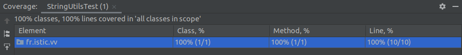
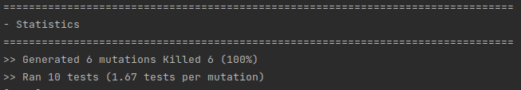

# Balanced strings

A string containing grouping symbols `{}[]()` is said to be balanced if every open symbol `{[(` has a matching closed symbol `)]}` and the substrings before, after and between each pair of symbols is also balanced. The empty string is considered as balanced.

For example: `{[][]}({})` is balanced, while `][`, `([)]`, `{`, `{(}{}` are not.

Implement the following method:

```java
public static boolean isBalanced(String str) {
    ...
}
```

`isBalanced` returns `true` if `str` is balanced according to the rules explained above. Otherwise, it returns `false`.

Use the coverage criteria studied in classes as follows:

1. Use input space partitioning to design an initial set of inputs. Explain below the characteristics and partition blocks you identified.
2. Evaluate the statement coverage of the test cases designed in the previous step. If needed, add new test cases to increase the coverage. Describe below what you did in this step.
3. If you have in your code any predicate that uses more than two boolean operators check if the test cases written so far satisfy *Base Choice Coverage*. If needed add new test cases. Describe below how you evaluated the logic coverage and the new test cases you added.
4. Use PIT to evaluate the test suite you have so far. Describe below the mutation score and the live mutants. Add new test cases or refactor the existing ones to achieve a high mutation score.

Write below the actions you took on each step and the results you obtained.
Use the project in [tp3-balanced-strings](../code/tp3-balanced-strings) to complete this exercise.

## Answer

1. The input domain is equal to string domain. It could be a computed string or anything else. 
In this exercise, it is important to use a string that contains some of those characters : `{,(,[,],),}`


2. We are using intellij Idea, it's such easy to get the coverage of method or class with it, 
we just have to right click on the `MyTestClass.java` > `More Run/Debug` > `Run MyTestClass with coverage`
and te result will be displayed in your IDE.


3. I do not have predicate that use 2 or more boolean so i passed this question

4. We used to run `pitest:mutationCoverage` plugin of Maven. For the five test we had write, 6 mutants
were created and 6 were killed in the first run so we did not have to write more tests


some results has been generated in ```code/tp3-balanced-strings/target/pit-reports/202203091621/fr.istic.vv/index.html```

