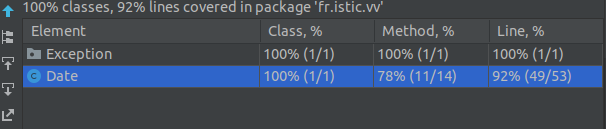
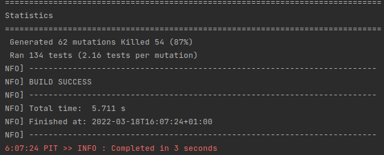
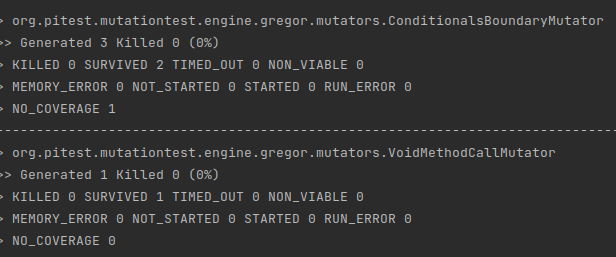
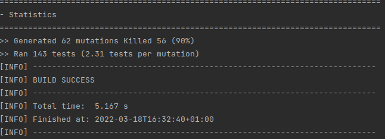

# Test the Date class

Implement a class `Date` with the interface shown below:

```java
class Date implements Comparable<Date> {

    public Date(int day, int month, int year) { ... }

    public static boolean isValidDate(int day, int month, int year) {
       
    }

    public static boolean isLeapYear(int year) { ... }

    public Date nextDate() { ... }

    public Date previousDate { ... }

    public int compareTo(Date other) { ... }

}
```

The constructor throws an exception if the three given integers do not form a valid date.

`isValidDate` returns `true` if the three integers form a valid year, otherwise `false`.

`isLeapYear` says if the given integer is a leap year.

`nextDate` returns a new `Date` instance representing the date of the following day.

`previousDate` returns a new `Date` instance representing the date of the previous day.

`compareTo` follows the `Comparable` convention:

* `date.compareTo(other)` returns a positive integer if `date` is posterior to `other`
* `date.compareTo(other)` returns a negative integer if `date` is anterior to `other`
* `date.compareTo(other)` returns `0` if `date` and `other` represent the same date.
* the method throws a `NullPointerException` if `other` is `null` 

Design and implement a test suite for this `Date` class.
You may use the test cases discussed in classes as a starting point. 
Also, feel free to add any extra method you may need to the `Date` class.


Use the following steps to design the test suite:

1. With the help of *Input Space Partitioning* design a set of initial test inputs for each method. Write below the characteristics and blocks you identified for each method. Specify which characteristics are common to more than one method.
2. Evaluate the statement coverage of the test cases designed in the previous step. If needed, add new test cases to increase the coverage. Describe below what you did in this step.
3. If you have in your code any predicate that uses more than two boolean operators check if the test cases written to far satisfy *Base Choice Coverage*. If needed add new test cases. Describe below how you evaluated the logic coverage and the new test cases you added.
4. Use PIT to evaluate the test suite you have so far. Describe below the mutation score and the live mutants. Add new test cases or refactor the existing ones to achieve a high mutation score.

Use the project in [tp3-date](../code/tp3-date) to complete this exercise.

## Answer


1. More methods than BalancedStrings so more tests. Like this exercise we were not sure to understand well what is 
the input space partitioning that we should use for tests. Because first we understand that we should test for all 
the domain, so we tried to cover it with random tests, but it was hard to determine if they are going to be wrong or not.
So finally we wrote test and tried to cover classic and specific case.

For us the main method is `isValidDate()` because others depend on this one, so we focus the tests for this method
wrote random test. 

`nextDate()`, `previousDate()` and `compareTo(Date)` are complex method because there were many case to cover. Depend on
the current month if it is a 31 ending one, if we are on february, if we are the first or last day on year... So obviously 
they have such commons things, conditions and if we had more time we could write it better and maybe take more time 
to reflect on how to write it using a switch conditions if possible.

2. Find below the coverage of our test for `Date` class. 



We can see that we have 3 methods that are not tested but it should be getters and/or setters and maybe `equals(Object)`


4. Find below the result of pitest:mutationCoverage algorithms.



As we can see we have some mutators that survived, for example those that are generated for a specific algorithms-test
and no one is killed. But despite the percentage of surviving mutators is quite good, 87%. 



We can see that ConditionalBoundary pitest algo told us that our test are not sufficient.
So we wrote more test to upgrade pitest mutators killed (poor mutators) in objectives
to killed one or more ConditionalBoundaryMutators. I look in the code where we used 
inferior or superior conditions, `compareTo(Date)` is the only one, so I write more tests for this class.
Here you can see pitest:mutationCoverage after writing new tests.



Unfortunately it did not kill the target, but someone took a stray bullet. Sorry for him but 
our suit test is better now. 


